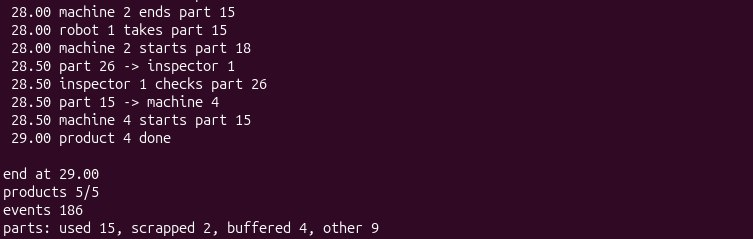
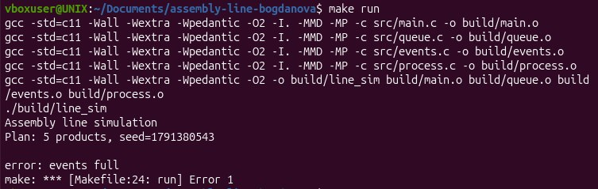

# Сборочная линия

## 1. Личные данные
**Богданова Мария Алексеевна БПИ253-1     
Вариант №44**

## 2. Условие задачи
Предприятие выпускает изделия, состоящие из нескольких деталей. Для каждой детали задан технологический маршрут: последовательность операций на станках определённых типов. Готовые детали поступают в промежуточные накопители, после чего сборочный пост может начать работу только при наличии полного комплекта компонентов. 
После обработки деталь проходит контроль качества. Годная деталь передаётся дальше, бракованная направляется на повторную обработку или списывается. Вместимость накопителей ограничена, поэтому заполненный выходной буфер способен приостановить станок. Транспортные роботы перемещают детали между стадиями.
 Требуется разработать консольное приложение, моделирующее сборочную линию.

## Входные параметры 
•	перечень изделий и состав комплектов;
•	технологические маршруты деталей;
•	количество станков и сборочных постов;
•	число транспортных роботов; 
•	длительность операций; 
•	вместимость накопителей; 
•	вероятность брака и правила повторной обработки; 
•	план выпуска изделий.

## Отображаемые события 
Необходимо отображать создание детали, постановку в очередь, начало и окончание операции, контроль качества, обнаружение брака, повторную обработку, перемещение, поступление в комплект, начало сборки и выпуск изделия.

## Инварианты 
•	станок обрабатывает не более одной детали; 
•	деталь находится на одной стадии или у одного транспортного робота;
•	операция выполняется после всех предыдущих операций маршрута; 
•	забракованная деталь не входит в готовое изделие; 
•	сборка начинается только при наличии полного допустимого комплекта.

## Завершение
Программа завершается после выполнения плана, исчерпания исходных деталей либо признания дальнейшего производства невозможным. Станки, контролёры, сборочные посты, транспортные роботы и детали являются самостоятельными участниками модели.

## 3. Структура проекта и сборка
Проект состоит из пяти файлов исходного кода в каталоге src/ и пяти заголовков в каталоге headers/. Вся логика модели сосредоточена в process.c.

- `src/main.c` - точка входа: seed, `srand`, запуск модели, печать итога.

- `src/process.c` - ядро: обработчики событий, диспетчер, роботы, накопители.
- `src/events.c` - очередь будущих событий, отсортированная по времени.
- `src/queue.c` - очередь id деталей.
- `headers/params.h` - входные параметры; `members.h` - структуры участников; `process.h` - состояние модели `Process`.

Команды: 
 `make`, `make run`, `make run SEED=5`, `make clean`.

## 4. Сценарий

## Участники модели 
Каждый участник модели - отдельная структура в `members.h`, его поведение - набор функций в `process.c`, а время изменяется только событиями из очереди `EventQueue`, поэтому вся симуляция идёт в одном потоке.

## Главный цикл
Главный цикл находится в файле `process.c`, в функции `process_run` (524). Функция берёт ближайшее событие, переводит время, вызывает обработчик и затем обращается к диспетчеру `try_start_all` (275), который после каждого события перебирает всё, что могло стать возможным для выполнения. Цикл останавливается, когда выпущено `PLAN` изделий или события закончились.

## События
Тип события и объект, к которому оно относится, описаны в events.h, очередь событий всегда отсортирована по времени.

## Маршрут детали по линии
1. `EV_CREATE_PART`: деталь создана, `handle_create` (330) выбирает станок нужного типа по кругу и запоминает пункт назначения в `Part.dest_type` и `Part.dest_id`.

2. `request_robot` (82): свободный робот забирает деталь сразу, иначе её id встаёт в очередь robot_queue.

3. `EV_ROBOT_DROP`: деталь поступает в очередь станка через `part_arrive` (99), `try_start_machine` запускает операцию, когда станок свободен.

4. `EV_OPER_DONE`: если операции маршрута остались, деталь едет на следующий станок, иначе к контролёру `choose_inspector` (45).

5. `EV_CONTROL_DONE`: годная деталь попадает в накопитель своего типа, бракованная возвращается на последнюю операцию маршрута или списывается.

6. `try_start_assembly`: когда в каждом накопителе есть деталь, пост забирает по одной и через ASM_TIME выпускает изделие.

Кроме того, заполненный накопитель приостанавливает контролёра: деталь остаётся у него в `blocked_part`, а `try_start_all` снимает блокировку, когда сборка освободит место. 

## Обеспечение инвариантов

1. *Станок не берёт вторую деталь:* флаг `Machine.busy`, проверка в `try_start_machine` (190).

2. *Деталь в одном месте:* одно состояние `PartState`; её id лежит либо в одной очереди, либо в поле `part_id` робота, станка или контролёра (`request_robot`, `part_arrive`).
3. *Порядок операций:* `oper_idx` растёт только в `handle_oper_done` (354), длительность берётся из `oper_time[ptype][oper_idx]`.
4. *Брак не в изделии:* в накопитель попадают только детали, прошедшие контроль (`handle_control_done`).
5. *Полный комплект:* `kit_ready` (162) и `products_started < PLAN` проверяются в `try_start_assembly` (238).

## 5. Пользовательский интерфейс
Ввода во время работы нет. Параметры задаются в `headers/params.h`, единственный аргумент командной строки - seed (необязательный) генератора случайных чисел. Вывод - построчный журнал событий: время, а затем событие.

*Соответствие событий строкам журнала:*

- создание детали: `part N created`;
- постановка в очередь: `part N -> machine K`, `part N -> inspector K`, `part N waits robot`;
- начало операции: `machine K starts part N`;
- окончание операции: `machine K ends part N`;
- контроль: `inspector K checks part N`, `part N ok`;
- обнаружение брака: `part N bad`, повторная обработка: `part N rework`, списание: `part N scrapped`;
- перемещение: `robot R takes part N`;
- поступление в комплект: `part N in buffer T`;
- начало сборки: `assembly K starts product P`;
- выпуск изделия: `product P done`;
- накопитель полон / место освободилось: `inspector K blocked` / `inspector K unblocked`;
- нет станка нужного типа: `part N: no machine`

Если план не выполнен, для заблокированных контролёров добавляются строки `inspector K stuck with part N`.

Также в конце выводится статистика, за неё отвечает `process_print_stats` (578 в process.c)

## Запуск и завершение

*Запуск:*

- `make run` или `./build/line_sim` — seed берётся из `time(NULL)` (`src/main.c`, 16), каждый запуск разный;

- `make run SEED=5` или `./build/line_sim 5` — seed задан (`strtoul`, 13), вывод воспроизводится; нечисловой аргумент даёт seed 0.

Перед запуском можно изменить исходные данные в params.h.

*Завершение:*

Цикл в `process_run` останавливается, когда выпущено `PLAN` изделий или очередь событий пуста.

- *План выполнен* - исходные параметры в `params.h`;`

- *Дедлок инспектора* - `BUFFER_CAP` 1, `ASM_TIME` 100, `PROB_DEFECT` 0 -> inspector N stuck, не все детали сделались;
- *Всё списано* - `PROB_DEFECT` 1.0, `PROB_REDO` 0.0 -> products 0/5, scrapped = все;
- *error: events full* - `MAX_EVENTS` 20 при `PLAN`=5, `EXTRA`=5, `TYPES`=3;
- *error: robot queue full* - `MAX_QUEUE` 5, `NUM_ROBOTS` 1, `ROBOT_TRAVEL` 10;
- *error: machine N queue full* - `MAX_QUEUE` 3;
- *error: inspector N queue full* - `MAX_QUEUE` 5, `NUM_INSPECTORS` 1, `CONTROL_TIME` 20, `NUM_ROBOTS` 6, `NUM_MACHINES` 9, `machine_type[NUM_MACHINES]` {0, 0, 0, 1, 1, 1, 2, 2, 2};
- *error: too many parts* - `MAX_PARTS` 50, `PLAN` 10, `EXTRA` 10.

Пример выполнения плана:

Пример ошибки: 

